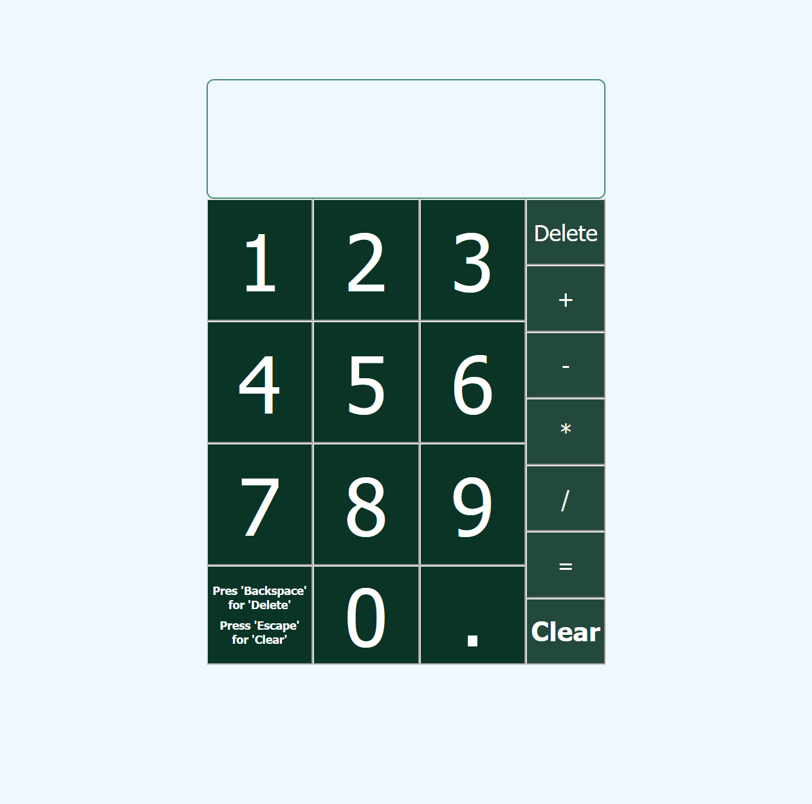

# Calculator

This project uses HTML, CSS and Javascript. The calculator can perform basic math operations. Keyboard support is built in.

## The Odin Project: Lesson Calculator

This project is build according to the specification of the [Calculator lesson](https://www.theodinproject.com/lessons/foundations-calculator)

## Live website

Access the [Calculator](https://gohan61.github.io/calculator/)

